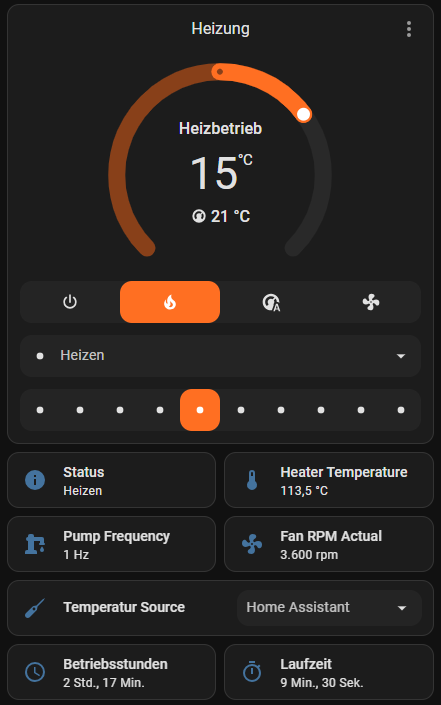

# 🔥 Autoterm UART Bridge für ESPHome

Dieses Projekt implementiert eine vollständige **UART-Bridge zwischen Autoterm/Planar-Heizungen und dem Bedienteil**, mit Integration in **ESPHome** und damit Home Assistant.  
Es erlaubt das **Überwachen und Steuern der Heizung** direkt über WLAN, MQTT oder Home Assistant Entities.

---

> [!WARNING]
> **Experimentelles Projekt – Nutzung auf eigene Gefahr!**  
> Dieses Repository befindet sich **noch in Entwicklung**. Falsche Verdrahtung, fehlerhafte Konfiguration oder unvorhersehbares Verhalten der Firmware können die **Heizung beschädigen**.
>
> Wenn du dir unsicher bist: **nicht verwenden**.

---

## 📦 Funktionsübersicht

- 🧭 **Bidirektionale UART-Bridge** zwischen Display und Heizung inkl. Durchleitung aller Frames  
- 📊 **Sensor-Outputs**: interne/externe/Heiz- und Paneltemperatur, Bordspannung, Statuscode/Text, Lüfterdrehzahlen (Soll/Ist) sowie Pumpenfrequenz  
- 🌡️ **Climate-Entity mit Presets**: steuert Heizen, Automatik, Lüften und Leistungsstufen über ESPHome/Home Assistant  
- 🎚️ **Direkte Stellgrößen**: separates Number-Entity für Lüfterstufe und Select-Entity zur Wahl der Temperaturquelle (inkl. „Home Assistant“-Feed)  
- 🛰️ **Virtuelles Panel**: optionaler Override injiziert eine externe Temperatur in den Panel-Datenstrom  
- 🧩 **Nahtlose Home-Assistant-Integration** durch native ESPHome-Komponenten  
- 🧾 **Ausführliches Logging** der übertragenen Frames (HEX) im Debug-Level  
- ⚙️ **Fallback-Logik**: automatische Status-/Settings-Abfragen, wenn kein Bedienteil erkannt wird  

---

## Screenshots


---

## 🔥 Heizmodi im Detail

- **Leistungsmodus**  
  Offener Leistungsbetrieb: Die Heizung arbeitet ausschließlich mit der gewählten Stufe (`0–9`) und ignoriert Zieltemperaturen. Ideal zum schnellen Aufheizen oder wenn dauerhaft hohe Leistung benötigt wird.

- **Heizen**  
  Stufenregelung bis zur Zieltemperatur: Die Heizung nutzt die gewählte Temperaturquelle, erhöht die Leistung bis der Sollwert erreicht ist und läuft anschließend dauerhaft in der niedrigsten Stufe weiter.

- **Heizen+Lüften**  
  Hybridmodus: Die Heizung startet im Heizbetrieb, reduziert aber auf reinen Lüfterbetrieb, sobald die Zieltemperatur erreicht ist. Sobald es kühler wird, schaltet sie automatisch wieder auf Heizen. Intern wird `wait_mode = 0x01` genutzt.

- **Fan Only**  
  Entspricht dem „Nur Lüften“-Modus der originalen Bedieneinheit. Der Brenner bleibt aus, lediglich der Lüfter läuft mit der vorgegebenen Stufe (`0–9`). 

- **Thermostat**  
  Leistungsmodus mit einstellbarer Hysterese: Die Heizung läuft mit der gewählten Stufe, bis die Temperatur das obere Band `SET + Hys_off` überschreitet. Anschließend wird automatisch ein Abkühlzyklus gestartet (temporär `SET − 5 °C`, `wait_mode = 0x01`). Sobald der Status „Nachlauf-Lüftung“ erreicht ist, wird ein Standby-Kommando gesendet und der Brenner bleibt aus, bis die Temperatur wieder unter `SET − Hys_on` fällt. Standardmäßig gelten `Hys_on = 2 °C` und `Hys_off = 1 °C`; beide Werte lassen sich im Climate-Block per `thermostat_hysteresis_on` (1–5 °C) und `thermostat_hysteresis_off` (0–2 °C) anpassen.

Jeder Modus kann über das Climate-Entity oder automatisiert per ESPHome/Home Assistant gesteuert werden. Nach Wechseln von Presets aktualisiert die Firmware die internen Settings und sendet passende UART-Frames an die Heizung.

---

## ⚙️ Beispielkonfiguration

Die vollständige Beispielkonfiguration findest du in der Datei **`air2d.yaml`**.  
Sie zeigt, wie die Autoterm-UART-Komponente in ESPHome eingebunden wird.  
Passe die Datei unbedingt an deine **eigene Verkabelung, GPIOs und Gerätekonfiguration** an.

Für den Thermostat-Modus kannst du die Hysterese direkt im Climate-Block definieren:

```yaml
climate:
  id: autoterm_climate
  thermostat_hysteresis_on: 2.0     # einschalten sobald Temp < SET - 2 °C
  thermostat_hysteresis_off: 1.0    # ausschalten sobald Temp > SET + 1 °C
```

Die Werte lassen sich innerhalb der zulässigen Bereiche `1–5 °C` (Hys_on) bzw. `0–2 °C` (Hys_off) anpassen.

---

## 🧩 Entitäten in Home Assistant

| Typ | Name (Standard) | Beschreibung |
|------|----------------|--------------|
| Climate | Autoterm Climate | Vollständiges Climate-Entity mit Modi, Presets und Zieltemperatur |
| Sensor | Internal Temperature | Temperatur im Heizgerät (°C) |
| Sensor | External Temperature | Externer Temperaturfühler (°C) |
| Sensor | Heater Temperature | Temperatur am Wärmetauscher (°C) |
| Sensor | Panel Temperature | Panel-/Display-Temperatur (°C, real oder virtuell) |
| Sensor | Voltage | Versorgungsspannung der Heizung (V) |
| Sensor | Fan RPM Set | Angeforderte Lüfterdrehzahl (rpm) |
| Sensor | Fan RPM Actual | Gemessene Lüfterdrehzahl (rpm) |
| Sensor | Pump Frequency | Takt der Dosierpumpe (Hz) |
| Text Sensor | Status Text | Klartextstatus, inklusive HEX-Fallback bei unbekannten Codes |
| Select | Temperature Source | Auswahl der Temperaturquelle (Intern/Panel/Extern/Home Assistant) |

Für ein Panel-Temperatur-Override kann zusätzlich ein bestehender Sensor (z. B. aus Home Assistant) eingebunden und unter `panel_temp_override.sensor` referenziert werden. Dieser wird genutzt, wenn die Temperaturquelle „Home Assistant“ gewählt ist.

---

## 🧠 UART-Kommunikation im Detail
 
Jede Nachricht (Frame) hat folgenden Aufbau:

| Byte-Index | Bedeutung | Beispielwert | Beschreibung |
|-------------|------------|---------------|---------------|
| 0 | Startbyte | `0xAA` | Kennzeichnet den Beginn eines Frames |
| 1 | Gerätekennung | `0x03` / `0x04` | `0x03` = Anfrage an Heizung, `0x04` = Antwort der Heizung |
| 2 | Länge des Payloads (in Bytes) | z. B. `0x13` | Anzahl Datenbytes zwischen Header und CRC |
| 3 | ? | `0x00` ||
| 4 | Funktionscode | `0x0F`, `0x02`, `0x03`, … | bestimmt den Typ der Nachricht |
| 5 … N−2 | Nutzdaten | – | variabel je nach Funktionscode |
| N−2, N−1 | CRC | z. B. `0x3A 0E` ||

CRC-Berechnung siehe Quellen.

---

### 🔹 Wichtige Funktionscodes

| Code (`data[4]`) | Richtung | Bedeutung / Zweck | Antwortgröße | Beschreibung |
|------------------|-----------|------------------|---------------|---------------|
| `0x0F` | Heizung → Display | **Statusmeldung** | 0x13 Bytes | enthält Temperaturen, Spannung, Lüfter- und Pumpenwerte sowie Statuscode |
| `0x02` | Heizung → Display | **Einstellungen (Settings)** | 6 Bytes | liefert aktuelle Parameter wie Temp-Quelle, Solltemp, Leistungsstufe usw. |
| `0x01` | Display → Heizung | **Power-Mode Start/Set** | 6 Bytes | Startet die Heizung bzw. setzt Leistungsstufe (`FF FF 04 FF 02 <level>`) |
| `0x02` | Display → Heizung | **Preset-/Temperatur-Update** | 6 Bytes | Überträgt Zieltemperatur & Sensorwahl (`FF FF <sensor> <temp> <preset> FF`) |
| `0x03` | Display → Heizung | **Standby / Power-Off** | – | beendet Heizvorgang (kein Payload) |
| `0x11` | Display ↔ Heizung | **Panel-Temperatur (Messwert)** | 1 Byte | realer oder virtueller Panel-Sensorwert (0–99 °C genutzt) |
| `0x23` | Display → Heizung | **Fan-Only-Modus** | 4 Bytes | aktiviert „Nur Lüften“ (`FF FF <level> FF`) |

---

### 🔸 Beispiel: Status-Frame (`0x0F`)

**Richtung:** Heizung → Display

**Beispiel (aus Log):**

```
[heater→display] Frame (26 bytes): AA 04 13 00 0F 00 01 00 11 7F 00 85 01 24 00 00 00 00 00 00 00 00 00 65 BB 0C
```

| Offset | Feld | Beispiel | Bedeutung |
|---------|------|-----------|-----------|
| 5–6 | Statuscode | `00 01` | 0x0001 = „standby“ |
| 7 | - | `00` | – |
| 8 | Interne Temperatur | `11` = 17 °C |
| 9 | Externe Temperatur | `7F` = 127 → −1 °C |
| 10 | - | `00` | – |
| 11 | Spannung (low) | `84` → 13.2 V (geteilt durch 10) |
| 12 | - | `01` | – |
| 13 | Heizung Temperatur | `24` - 15 = 21 °C | – |
| 14 | - | `00` | – |
| 15 | - | `00` | – |
| 16 | Lüfter Sollwert (raw) | `01` × 60 = 60 rpm |
| 17 | Lüfter Istwert (raw) | `24` × 60 = 2160 rpm |
| 18 | - | `00` | – |
| 19 | Pumpenfrequenz (raw) | `00` → 0.00 Hz (geteilt durch 100) |
| 20 | - | `00` | – |
| 21 | - | `00` | – |
| 22 | - | `00` | – |
| 23 | - | `64` | – |
| 24–25 | CRC16 | `3A 0E` | gültig |

**Bekannte Statuscodes:**

| Code | Beschreibung |
|------|---------------|
| `0x0001` | standby |
| `0x0100` | cooling flame sensor |
| `0x0101` | ventilation |
| `0x0200` | prepare heating |
| `0x0201` | heating glow plug |
| `0x0202` | ignition 1 |
| `0x0203` | ignition 2 |
| `0x0204` | heating combustion chamber |
| `0x0300` | heating |
| `0x0323` | only fan |
| `0x0304` | cooling down |
| `0x0305` | idle ventilation |
| `0x0400` | shutting down |
| *andere* | unknown (HEX-Code wird mit angezeigt) |

---

### 🔸 Beispiel: Settings-Frame (`0x02`)

**Richtung:** Heizung → Display

```
AA 04 06 00 02 [use_work_time] [work_time] [temp_source] [set_temp] [wait_mode] [power_level] CRC_H CRC_L
```

**Beispiel:**

```
AA 04 06 00 02 00 78 02 0F 00 05 39 3D
```

| Byte | Bedeutung | Wert | Kommentar |
|------|------------|------|-----------|
| 5 | `use_work_time` | `00` | 0 = aktiv, 1 = deaktiv |
| 6 | `work_time` | `78` (120 min) | Arbeitszeit |
| 7 | `temperature_source` | `02` | 1 = intern, 2 = Panel, 3 = extern, 4 = keine Regelung |
| 8 | `set_temperature` | `0F` (15 °C) | Solltemperatur |
| 9 | `wait_mode` | `00` | 1 = Warten an, 2 = aus |
| 10 | `power_level` | `05` (Stufe 5) | Leistungsstufe 0–9 |
| 11–12 | CRC16 | `39 3D` | korrekt |

---

### 🔸 Beispiel: Panel-Temperatur-Frame (`0x11`)

**Richtung:** Display ↔ Heizung

```
AA 03 01 00 11 [temp_raw] CRC_H CRC_L
```

- `temp_raw` = 0–255 → 0–255 °C  
- Wird alle 2 s übertragen (oder vom ESP simuliert, wenn „Virtual Panel Override“ aktiv ist)

**Beispiel (Display → Heizung):**

```
AA 03 01 00 11 10 9B 66
```

→ Temperatur 16 °C

---

### 🔸 Power- und Standby-Kommandos

**Power / Leistungsstufe (`0x01` bzw. `0x02`)**

```
AA 03 06 00 01 FF FF 04 FF 02 [level] CRC_H CRC_L   # Start mit Stufe <level>
AA 03 06 00 02 FF FF 04 FF 02 [level] CRC_H CRC_L   # Stufe nach dem Start anpassen
```

**Standby (`0x03`)**

```
AA 03 00 00 03 CRC_H CRC_L
```

---

### 🔸 Fan Mode (Nur Lüften)

```
AA 03 04 00 23 FF FF [level] FF CRC_H CRC_L
```

- Aktiviert „Fan Mode“ (nur Lüfterbetrieb)  
- `level` = 0–9 (Leistungsstufe)

**Beispiel:**

```
AA 03 04 00 23 FF FF 08 FF 1A 2B
```

---

### 🔸 Anfrage-Frames vom ESP (bei fehlendem Display)

Wenn der ESP kein Bedienteil erkennt, sendet er regelmäßig eigene Requests:

| Funktion | Intervall | Frame | Zweck |
|-----------|------------|--------|--------|
| **Status-Request** | alle 2 s | `AA 03 00 00 0F CRC` | fordert aktuellen Heizstatus an |
| **Settings-Request** | alle 10 s | `AA 03 00 00 02 CRC` | fordert aktuelle Einstellungen an |

---

### 🔹 Übersicht aller bekannten Telegrammtypen

| Code | Richtung | Länge (Payload) | Zweck |
|------|-----------|----------------|-------|
| `0x0F` | Heater → Display | 19 B | Statusdaten |
| `0x02` | Heater → Display | 6 B | Settings lesen |
| `0x02` | Display → Heater | 6 B | Temperatur-/Preset-Update |
| `0x01` | Display → Heater | 6 B | Power-Mode Start/Stufe |
| `0x03` | Display → Heater | 0 B | Standby (Power OFF) |
| `0x11` | Display ↔ Heater | 1 B | Panel-Temperatur |
| `0x23` | Display → Heater | 4 B | Fan-Only-Modus |

---

## 🧑‍💻 Entwicklung & Tests

Getestet mit:

- **ESP32 DevKit v1**  
- **Autoterm Air 2D**  
- UART-Sniffer-Log zur Protokollanalyse  
- CRC-Validierung nach Modbus-Standard  
- ESPHome 2025.x / Home Assistant 2025.x  

---

## 🛠️ Bekannte Einschränkungen

- Autoterm-Protokoll teilweise reverse-engineered  
- Unbekannte Statuscodes werden als HEX angezeigt  
- UART-Verbindungen müssen elektrisch sauber sein   

---

## 📚 Quellen & Referenzen

- 🔗 [schroeder-robert / autoterm-air-2d-serial-control](https://github.com/schroeder-robert/autoterm-air-2d-serial-control)  
  Reverse Engineering und Steuerung der Autoterm Air 2D über serielle Schnittstelle.

---

## 📄 Lizenz

MIT License © 2025  
Entwickelt von **Tim**
